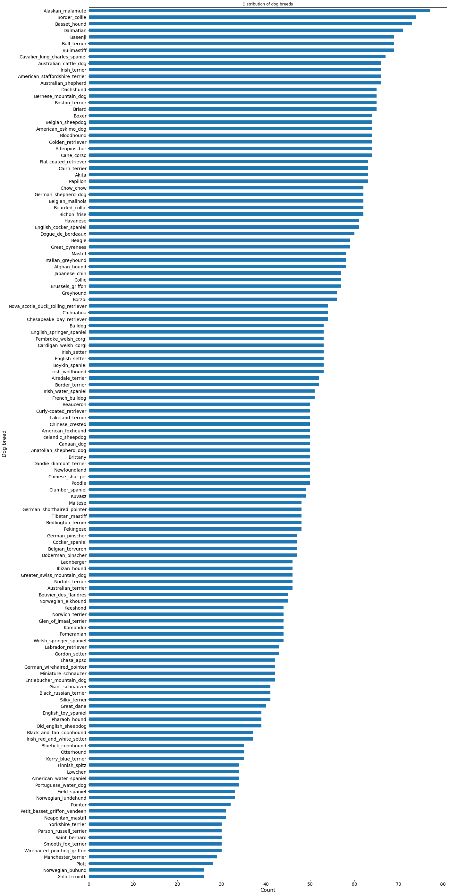
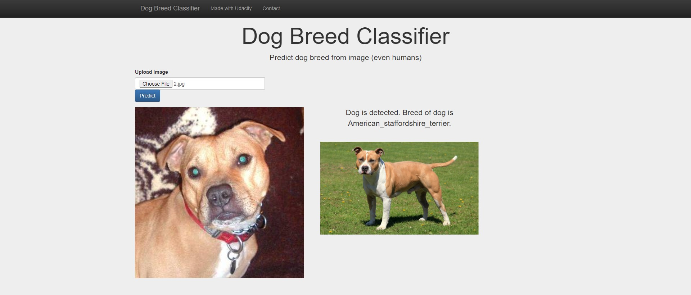
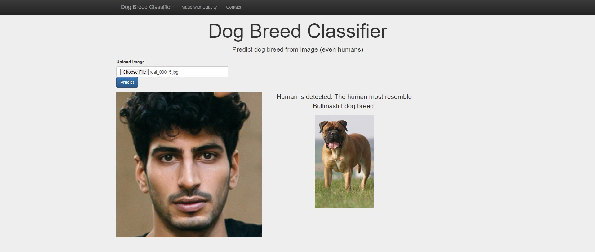
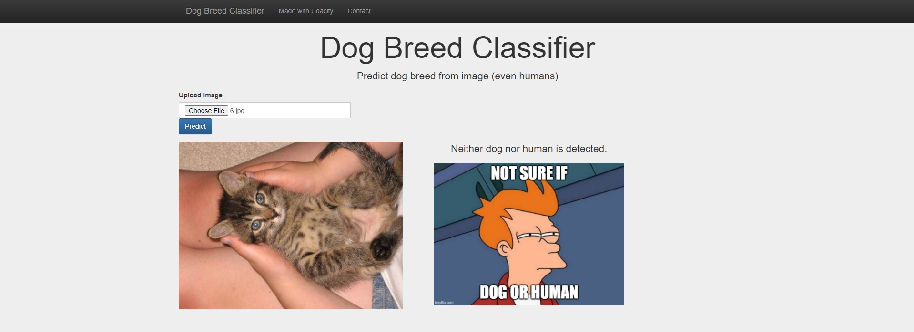

# Dog-Breed-Classifier

## Project Definition
### Project Overview:
To predict dog breed from real-world, user uploaded images using Convolutional Neural Networks (CNN). Given an image of a dog, estimate the canine’s breed. If the uploaded image is of a human, the resembling dog breed will be estimated. If neither human nor dog are detected, this will be indicated with an error output.

[Dog images](https://s3-us-west-1.amazonaws.com/udacity-aind/dog-project/dogImages.zip) were provided by Udacity, while [pre-trained face detectors](https://github.com/opencv/opencv/tree/master/data/haarcascades) were provided by OpenCV.

Additionally, [pre-train Resnet50 deep learning model](https://github.com/fchollet/deep-learning-models/releases/download/v0.2/resnet50_weights_tf_dim_ordering_tf_kernels.h5), with [model weighs](https://s3-us-west-1.amazonaws.com/udacity-aind/dog-project/DogResnet50Data.npz) and [image classification categories](http://ethereon.github.io/netscope/#/gist/db945b393d40bfa26006), were used in transfer learning to speed up and improve accuracy of predictions with fewer input images needed for re-training.

### Problem Statement:
The goal is to build a web application that can predict dog breed from uploaded images using deep learning. Tasks involved are:
1. Develop human face detector from images using OpenCV's Haar feature-based cascade classifiers.
2. Develop dog detector from images from pre-trained Resnet50 image classification model.
3. Use transfer learning to re-train a CNN model for image classification of dog breeds.
4. Create web application that will predict dog breed from uploaded images.

### Metrics:
Metric used is accuracy since it takes into account both true positives and true negatives equally and is a common metric for binary classification. Since the dog image dataset for each breed is quite balanced, i.e. relatively equal number of images per breed (average = 50+/-11 images), accuracy is an appropriate measure.

## Analysis
### Data Exploration:
From the dog image dataset, there 133 total dog categories and 8351 total dog images. 6680 belongs to the training dog images, while 835 are in validation dog images. For testing, there are 836 test dog images. The average number of dog images for each breed is 50, with minimum of 26 images. The distribution of dog breeds and number of images is illustrated below.

## Methodology
### Data Preprocessing:
**Image Detectors**

For human face detectors, the uploaded images are converted to grayscale prior to passing to classifier.

For dog detector, the pre-trained Resnet50 model classifier requires the input image to be converted to BGR by reordering the channels and normalized such that the mean pixel (calculated from all pixels in all images in ImageNet) is subtracted from every pixel in each image. This is implemented in the imported Keras function `preprocess_input`. 

**Model**

For the dog breed classifier, the re-trained Resnet50 model requires the uploaded color 2D image to be resized to 224 by 224, converted to 3D array with shape (224, 224, 3) where 3 is the number of channels - RGB, and converted to 4D tensor with shape (1, 224, 224, 3) where 1 is the number of image. This is implemented in the function `path_to_tensor` in `scripts\image_inference.py`.

No image manipulation were performed on the dog images. Although image augmentations (e.g. rotation, shearing, scaling) could have been performed to increase the variability of the training dataset for better performance during inference of unseen images.

### Implementation:
**Image Detectors**

For human detector, OpenCV's implementation of [Haar feature-based cascade classifiers](http://docs.opencv.org/trunk/d7/d8b/tutorial_py_face_detection.html) was used to detect human faces in images with their [pre-trained face detectors](https://github.com/opencv/opencv/tree/master/data/haarcascades) for frontal and profile faces.

For the dog detector, the [pre-trained Resnet50 model](https://github.com/fchollet/deep-learning-models/releases/download/v0.2/resnet50_weights_tf_dim_ordering_tf_kernels.h5) that was trained to detect many objects from images, including dogs, was used.

**Model**

Transfer learning was used to create a CNN from a [pre-trained Resnet50 model](http://ethereon.github.io/netscope/#/gist/db945b393d40bfa26006) that can identify dog breed from images. Bottleneck features from the Resnet50 model, already pre-trained to [classify 1000 objects](http://ethereon.github.io/netscope/#/gist/db945b393d40bfa26006) from millions of images, allows feature maps previous extracted to be re-used in other image classifications, thereby reducing training time and require fewer new images for training.

The pretrain Resnet50 model was extended to classify dog breeds by adding a GlobalAveragePooling2D layer that accepts the input images with the same size of the pretrained images and applying a softmax activation to output the current desired size. The [weights in the pretrained Resnet50 model](https://s3-us-west-1.amazonaws.com/udacity-aind/dog-project/DogResnet50Data.npz) was used as initial starting point to the training using the dog training and validation image set.

### Refinement:
**Image Detectors**

For human detector, initially only the pre-trained frontal face classifiers were used but since profile views could also be uploaded by users, detection of profile faces were added also by adding the pre-trained classifiers for profile views from OpenCV.

**Model**

Initially a pre-trained VGG19 image classification model was used in transfer learning, but the performance was only at 47% accuracy. As such, the pre-trained Resnet50 model was used instead to improve on the classification accuracy.

## Results
### Evaluations:
**Image Detectors**

Using a test set of 100 human faces, human face was detected in 100% of them while dog was detected in none of them.

Using a test set of 100 dog images, dog was detected in all of them, while human face was detected in 21% of them.

**Model**

Using 6680 dog images for training and 835 dog images for validation, training was perform on the extended Resnet50 model for 20 epochs and batch size of 20. The accuracy of the classification for the 836 test images is 81% using the saved best weights. Pretty good performance for such a small model (270k parameters), which makes it suitable for web applications. 

### Justification:
**Image Detectors**

Human and dog detectors performed generally well, with all human faces and dogs detected accuracy with their respective detectors. However, there are some misclassifications with images of children and persons of color, which warrants further improvements with re-trained classifiers using more diverse human faces.

**Model**

Switching from VGG16 pre-trained model with 68k parameters to Resnet50 model with 272k parameters greatly improved accuracy from 47% to 81%. Changing to an even more complex model like Inception or Xception may further increase accuracy but the simplier Resnet50 model is already showing indications of overfitting with a training accuracy of 94.66% but a validation accuracy of 80.00% at the best saved epoch. Training accuracy and validation accuracy should be relatively close for an appropriately fitted model that has been generalized to images it has not seen. So for a more complex model, it is expected overfitting may be more signficant with greater disparity between training and validation accuracy. A better improvement instead may be by augmenting the dog images to increase the variability and adding more images to each dog breed.

During testing, generally there are mostly accurate predictions, with some misclassifications of the dog breed particularly those that closely resemble each other.

## Conclusion
### Reflection:
The steps to development of a web application to predict dog breed from images requires,
1. Develop image detectors to distinguish images as human faces, dogs or other
2. Leveraged from pre-trained OpenCV face detector and pre-trained deep learning image classification model (Resnet50).
3. Re-train a CNN model for image classification of dog breeds using dog images via transfer learning.
4. Make dog breed predictions using the newly trained classifier model from uploaded images. 
5. Wrap a web application using Flask around it.

The development of the image detectors and transfer learning were interesting since images were a data type not covered in the course. The web application with uploaded images also required further research (i.e. Googling) to work out. The write up is particularly exhausting since this is a ReadMe rather than a blog post.

### Improvement:
**Areas for Improvements**
1. Add augmentation to training dataset that includes rotation, rescaling, width and height shifts, zooming, adding noise, etc. to increase the variability of input data to the training.
2. More variety is also needed to close resembling breeds to help extract the features to disguish them apart.
3. The human face detector also gave an inaccurate classification for some human images. The pre-trained haarcascade_frontalface xml can be re-trained with greater variety of human faces to include more diverse people and children.

## How to Use
### File Structure:
 
    ├── data                   
    │   ├── haarcascades                                   # OpenCV pre-trained face detectors
    │   │   ├── haarcascade_frontalface_alt.xml            # Pre-train frontal face alt face detector in xml
    │   │   ├── haarcascade_frontalface_alt2.xml           # Another pre-train frontal face alt face detector in xml
    │   │   ├── haarcascade_frontalface_default.xml        # Default frontal face alt face detector in xml
    │   │   ├── haarcascade_profileface.xml                # Pre-train profile face alt face detector in xml
    │   ├── images                                         # Images used for Jupyter notebook
    │   │   ├── testing                                    # Images used for testing
    │   ├── saved_models   
    │   │   └── model_Resnet50                             # Resnet50 model trained for classifying dog breeds.
    │   └──  dog_names.csv                                 # List of dog breeds
    ├── dogclassifierapp
    │   ├── static
    │   │   ├── breeds                                     # Sample images for each dog breed
    │   │   ├── img                                        # Images for website
    │   │   ├── script.js                                  # Javascript for website
    │   │   └── style.css                                  # Stylesheet for website
    │   ├── templates
    │   │   └── index.html                                 # Main page for website
    │   ├── __init__.py                                    # Init for Flask
    │   ├── routes.py                                      # routes for Flask
    ├── scripts
    │   ├── extract_bottleneck_features.py                 # functions to extract pretrained
    │   ├── image_detectors.py                             # functions to detect dog or human face from images
    │   ├── image_inference.py                             # functions to make inference from images
    │   └── predict_dog_breed.py                           # functions to predict dog breed
    ├── uploads                                            # directory to temporarily hold uploaded image
    ├── dogclassifer.py                                    # Flask file to run app
    ├── README.md
    └── requirements.txt                                   # requirements

### Instructions:
1. Set up virtual environment and requirements.

    - Create virtual environment with Anaconda
        `conda create -n dogclassifier python=3.8 anaconda`
        
    - Install packages in requirements
        `pip install-r requirements.txt`

2. Run the following command in the app's directory to run your web app.
    `python dogclassifer.py`

3. Go to http://10.0.0.29:3011/

     
 
     
 
     
     
## Acknowledgements and References
**Dog images**

As part of the Udacity Data Scientist Nanodgree, the image datasets for [dogs and their breeds](https://s3-us-west-1.amazonaws.com/udacity-aind/dog-project/dogImages.zip) used for transfer learning were provided by Udacity.

**OpenCV Haar feature-based cascade classifiers**

[Pre-trained face detectors](https://github.com/opencv/opencv/tree/master/data/haarcascades).

**ResNet50**

[Diagram of architecture](http://ethereon.github.io/netscope/#/gist/db945b393d40bfa26006).

[Model of pre-trained Resnet50](https://github.com/fchollet/deep-learning-models/releases/download/v0.2/resnet50_weights_tf_dim_ordering_tf_kernels.h5).

[Weighs of pre-trained Resnet50 bottleneck features](https://s3-us-west-1.amazonaws.com/udacity-aind/dog-project/DogResnet50Data.npz).

[Image classification categories](http://ethereon.github.io/netscope/#/gist/db945b393d40bfa26006).

**Web Application**

[Flask handling of file uploads](https://blog.miguelgrinberg.com/post/handling-file-uploads-with-flask).

[Javascript for uploading files](https://bootsnipp.com/snippets/eNbOa).

[HTML for uploading fies](https://getbootstrap.com/docs/5.0/forms/input-group/).
