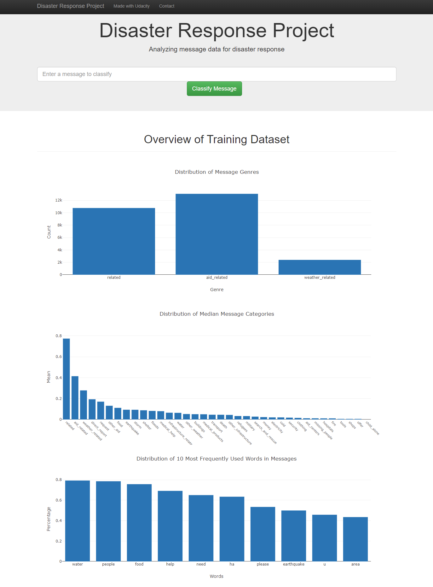

# Disaster Response Pipeline Project

### Purpose:
To analyze disaster data from Figure Eight to build a model for an API that classifies disaster messages. The data set contains real messages that were sent during disaster events and each category classification. A machine learning pipeline was created to categorize these events such that appropriate disaster relief agency can be deployed based on the need from the message. A web app provides the interface for an emergency worker to input a new message and get classification results in several categories, and also visualizes the data.

### File Structure:
    ├── app     
    │   ├── run.py                           # Flask file to run app
    │   └── templates   
    │       ├── go.html                      # Classification result webpag
    │       └── master.html                  # Main webpage    
    ├── data                   
    │   ├── disaster_categories.csv          # Dataset of categories  
    │   ├── disaster_messages.csv            # Dataset of messages
    │   └── process_data.py                  # ETL data
    ├── models
    │   └── train_classifier.py              # Train ML model           
    └── README.md

### Instructions:
1. Run the following commands in the project's root directory to set up your database and model.

    - To run ETL pipeline that cleans data and stores in database
        `python data/process_data.py data/disaster_messages.zip data/disaster_categories.zip data/messages.db`
        
    - To run ML pipeline that trains classifier and saves
        `python models/train_classifier.py data/messages.db models/classifier.pkl`

2. Run the following command in the app's directory to run your web app.
    `python app/run.py`

3. Go to http://0.0.0.0:3001/

